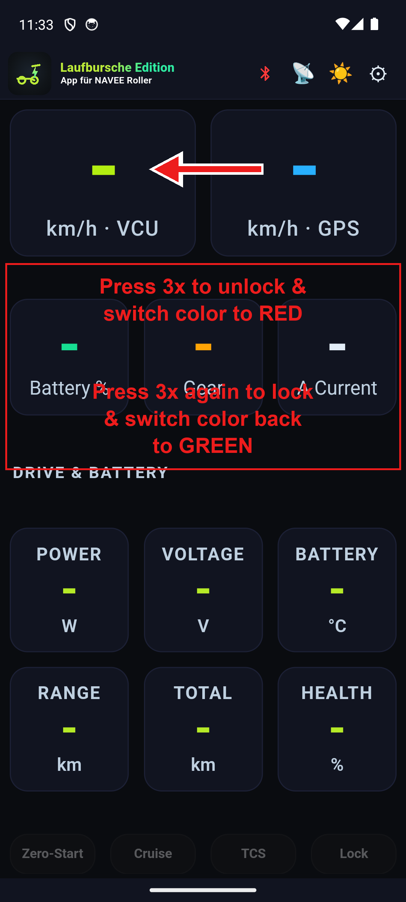

# Laufbursche Edition (NAVEE)

An alternative app for NAVEE e-scooters.

> **This is a feasibility study.** It exists to show what a NAVEE scooter's Bluetooth protocol makes possible, not to be a finished product. Error-free operation is not promised and there is no warranty of any kind. Whatever you do with it, you do at your own risk. Read the [Disclaimer](#disclaimer--trademarks) before you install it.

Download the app: **[latest release](https://github.com/Laufbursche42/nv-lb-edition/releases/latest)** - install the `nv-lb-edition-vX.apk` from the assets there.

## Table of contents

- [For users](#for-users)
  - [What the app is](#what-the-app-is)
  - [Device support](#device-support)
  - [Features](#features)
    - [Dashboard](#dashboard)
    - ["All values" telemetry](#all-values-telemetry-scroll-down-on-the-main-screen)
    - [Connection](#connection)
    - [Scooter settings](#scooter-settings)
    - [Info & diagnostics](#info--diagnostics)
    - [Battery info](#battery-info)
    - [Screen streaming](#screen-streaming)
    - [Offline bicycle navigation](#offline-bicycle-navigation)
    - [Offline maps](#offline-maps)
    - [Recording, logging & preferences](#recording-logging--preferences)
  - [What the app deliberately does not do](#what-the-app-deliberately-does-not-do)
  - [Installing the app](#installing-the-app)
  - [Reporting problems](#reporting-problems)
  - [Privacy & data protection](#privacy--data-protection)
  - [Permissions](#permissions)
  - [Disclaimer & Trademarks](#disclaimer--trademarks)
- [License](#license)

# For users

## What the app is

Laufbursche Edition (NAVEE) is a standalone, alternative Android app for NAVEE e-scooters. It works completely offline and talks to your scooter directly over Bluetooth LE. There is no manufacturer account, no login, no user id and no cloud - install the app, connect to your scooter and you are ready to go.

The app is a fork of the author's app for another scooter platform, ported to the NAVEE protocol. Everything that was specific to that other platform was removed rather than carried over half-working; what is left is the part that has been checked against a NAVEE scooter.

**Using an iPhone?** This app is Android only. On iOS there is a browser-based alternative that speaks the same protocol over Web Bluetooth: **[navee-unlock](https://laufbursche42.github.io/navee-unlock/)**, opened in the Bluefy browser. No install, same functions.

## Device support

The app was built and checked against the **NAVEE XT5 family**. It connects to any scooter that advertises a Bluetooth name starting with `NAVEE` and speaks the same Bluetooth protocol.

Other NAVEE models that use the same protocol are **expected** to work, but they are **not verified** - nobody has confirmed them on hardware. Treat anything outside the XT5 family as untested: the connection and the read-only pages are the likely case, while a setting your model does not implement is simply ignored by the scooter. Which functions a given unit supports depends on its firmware, so a switch that has no effect on your scooter means the firmware did not accept it, not that the app failed to send it.

**Speed unlocking works on four families - others need flashing.** The flash-free speed release (drive mode 4, below) lifts the top speed on the four supported families: XT5 (Ultra, Pro, Max), UT5 Ultra X and E45/E60 Pro. On every other NAVEE model the speed cap sits in the scooter's own firmware, so raising it needs **patched firmware flashed to the scooter** - no Bluetooth setting reaches it. This was tried on a German NT5: it did not raise the speed. Reading the values and the everyday functions still work on those models; only the speed unlock needs the flash.

## Features

Everything below is implemented and shipping in the app.

### Dashboard

- **Live speed drums** - side-by-side scooter speed and GPS speed.
- **Hero tiles** - state of charge (SOC), the current drive mode (gear) and battery current at a glance.
- **Quick toggles** right below the tiles - zero-start, cruise control, traction control and the immobilizer. They are written to the scooter immediately, are greyed out while disconnected and colour in when the scooter reports the function as active, so you can see an accepted command at a glance.
- **Vehicle and battery grid** - remaining range, the max-speed parameter, pack voltage, battery temperature, battery SOH, charge cycles, total and trip distance, Bluetooth signal strength and the scooter's fault code.
- **Current ride (GPS)** - distance, time, average speed, altitude, climb and descent, GPS fix quality and the number of recorded points.

### "All values" telemetry (scroll down on the main screen)

- Shows **every value the app decodes** from the scooter, including the ones that have no tile of their own.
- **Each row has a "?" help popup** explaining what the value means.
- **Stale values clear when disconnected** so you never read an old number as live.

### Connection

- **Bluetooth LE connect** with a Bluetooth-glyph indicator: **green = connected, red = disconnected**.
- The scan matches scooters whose Bluetooth name starts with `NAVEE`. The scooter does not advertise its service UUID, so the name is what the scan filters on.
- **Remembers the last scooter and auto-reconnects.**
- **"Last device" quick-reconnect** button.
- Right after connecting the app sends a **clock sync** and then reads serial number, parameters, battery and firmware versions. There is no keep-alive to maintain and nothing is sent that you did not ask for.

### Scooter settings

- **Written immediately** over Bluetooth - there is no Save button because each control is a single command:
  - **Immobilizer** - lock or unlock the scooter electronically.
  - **Cruise control** - on or off.
  - **Traction control (TCS)** - on or off.
  - **Zero-start** - the kick-off level. On a USA-region scooter down to 0 (ride off without pushing); on other regions only 3 to 5, because the scooter's meter clamps the lower levels away, so they are hidden there.
  - **Drive mode** - the gear / riding level.
  - **Light** - auto light (the headlight comes on while riding), daytime running light and tail light.
  - **Eco / low-power mode** and the **display unit** (km/h or mph on the scooter's own screen).
- **A "?" help popup on the settings** that need one.
- **Model line** - the connected model is detected automatically from the scooter's serial and shown at the top of the settings.
- **The shown state comes from the scooter**, not from the phone: the live parameter report drives every control, so what you see is what the scooter currently reports.
- **The firmware has the last word.** The app sends the command and shows what comes back. A function your model or its firmware does not support stays without effect; the app does not pretend otherwise.

### Speed release and region - private ground only

These change how fast the scooter runs. **On public roads they are not legal: they void the operating permit (ABE) and the insurance cover.** Use them on your own scooter, on private ground.

- **Speed release** - one button (and a triple-tap on the km/h tile on the main screen) puts the scooter into its top drive mode, so it runs at its built-in top speed instead of the restricted one. The firmware sets the actual figure, so it is a range rather than a number you dial in. Supported on four families (XT5 Ultra/Pro/Max, UT5 Ultra X, E45/E60 Pro); every other model simply ignores it.
- **Region** - on non-XT5 models a panel writes a two-letter region code (for example US or DE) to test whether a more permissive region raises the limit. It is **blocked on the XT5 family** and asks you to confirm first, because the screen goes dark for a moment and the scooter usually restarts. It only has an effect where the scooter accepts the write; on the non-XT5 models the real limit sits in the firmware itself, so the write does nothing - confirmed on a German NT5, where it did not raise the speed. Lifting the speed there needs patched firmware, not this panel.

The quickest way to the speed release is a hidden gesture: **triple-tap the km/h VCU tile** on the main screen. The tile turns red while the release is active; triple-tap it again to lock the speed back to normal.

### Info & diagnostics

- **Error reports** view - the scooter reports **one numeric fault code**. The app decodes it against the official NAVEE fault table (one shared table across the models) and shows the plain-text cause, for example *E9 - controller and battery communication*. A code that is not in that table is shown **raw**, never guessed, and the whole lookup runs on the phone with no server.
- **Scooter info page**, read-only and read live over Bluetooth: the **Bluetooth name**, the **serial number** and the five firmware versions the scooter reports - display/meter, controller (BLDC), BMS, screen and UWB. (The app version lives in the "Version Info & Disclaimer" entry, not here.)

### Battery info

- **Battery Info page** - a dedicated view of the pack, read live over Bluetooth.
- **Pack summary** - state of charge, pack voltage, pack current (charging and discharging), state of health, battery temperature and the charge-cycle count.
- **Pack values only.** NAVEE does not stream per-cell voltages over this protocol, so there is no per-cell grid and no cell-balancing view. Nothing is faked to fill the page.

### Screen streaming

- **SRT screen streaming** to your own server - constant ~30 fps, with the server URL encrypted and stored on the device.

### Offline bicycle navigation

- **Live offline routing** that avoids motorways.
- **Enter start and destination** - type each as coordinates or long-press the map to drop the destination. Each field has a **"Here"** button that inserts your current GPS position and leaving the start empty simply means "start from my current position".
- **The map stays where you put it** - dragging the map does not snap back to your GPS position, so you can freely look around. Tap the crosshair button to recenter on yourself and resume auto-follow.
- **Route-preference profiles** - pick how the route is calculated:
  - **Balanced** - a mix of roads and paths that avoids motorways - a good all-round route.
  - **Shortest** - the shortest distance (may use bigger roads if they are shorter).
  - **Bike paths** - prefers cycleways and field tracks and avoids main roads as much as possible.
- **"Start navigation" follow-along mode** - after a route is calculated you tap **Start**; the map follows you and zooms in. A big next-turn card shows the upcoming turn and the distance to it plus the remaining distance and a rough ETA. A **Stop** button ends it.
- **Turn-by-turn voice guidance** using your phone's built-in text-to-speech. The directions are **spoken in your phone's language** (most EU languages are supported; anything else falls back to English), while the on-screen text stays English. It uses the TTS voice your phone already has - if that language's voice is not installed it falls back to another installed voice or, failing that, stays silent and just shows the directions on screen. Voice can be turned off.
- **Camping and Charging POI overlays** - charging is filterable by **Schuko / Type 2**. Download the POI data per country with the **Get POI** button on the offline-maps screen (built from OpenStreetMap, ODbL); it lands next to that country's map, so the overlays light up automatically once you have it.
- **Dark-map mode.**
- **"Show map"** - display a recorded ride on the offline map.
- **Automatic routing-data download** - the cycling-directions data (BRouter segments) downloads automatically for the area you route in. You can also download it manually and delete it on the maps page (the same screen where you download offline country maps).

### Offline maps

- **In-app EU offline map download** - per-country maps, no PC and no cables needed.
- Runs as a **background service**, so a download keeps going with the screen locked.
- **Per-map Delete** to free space.

### Recording, logging & preferences

- **GPS track recording** with a configurable interval (**1 / 2 / 5 / 10 / 30 s**) and **per-route GPX export**.
- **Ride log** (**off by default**) - when enabled, it records **all main-screen values once per minute** while you ride. Recording only starts once you are actually moving (after the scooter's speed first goes above 0), so parking or connecting without riding produces no ride. It runs as a foreground service so it keeps recording with the screen off, keeps **all rides** (delete them individually or in bulk by period) and lets you export each ride as **CSV or JSON** from the Scooter Info page (via the Android share sheet). The exported CSV/JSON can be visualised as graphs with the companion **[Laufbursche Edition Analysis Tool (leat)](https://github.com/Laufbursche42/leat)**.
- **In-app debug logging** - persistent, with a red banner while active and an **export** button. No PC needed.
- **Full-screen toggle** (when off, the app sits below the Android status bar), **km / mph** units (mph converts both speed and distance - Trip, Odometer and saved-route distances - to miles), **light / dark app theme**, a **Display settings** page for tile colour, background and text brightness and a **"Version Info & Disclaimer"** entry.
- **A language switch in the Display settings** turns the whole interface, help popups included, English or German. On the first start the app follows your phone's language and your choice sticks after that.

## What the app deliberately does not do

Naming the gaps is part of being honest about a feasibility study:

- **No firmware flashing, no OTA and no firmware files of any kind.** The app never writes firmware to the scooter and never downloads any.
- **No arbitrary speed number.** The speed release commands the scooter's own built-in top speed; it does not let you dial in a figure the firmware would not otherwise reach.
- **No identity or serial rename.**
- **No guessed fault meanings.** Known codes are translated from the official NAVEE table; any code outside it is shown raw, never invented.
- **No per-cell battery data, no dual-motor or motor-mode controls and no per-gear profile editor** - the NAVEE protocol as observed here does not offer them.

## Installing the app

There are two ways to install the app. The normal one is a plain sideload from a file manager (below), which keeps working on every phone including Xiaomi/MIUI. A computer/ADB install is only a power-user fallback.

### Normal install (file manager)

Copy the `nv-lb-edition-vX.apk` file to your phone and open it in a file manager to install it. No PC and no cables are needed - offline maps are downloaded inside the app.

**Allow "install unknown apps" (Android 8 and newer).** Because the app does not come from the Play Store, Android must be allowed to install it. The first time you tap the downloaded APK, Android will ask you to let the app you opened it with (your file manager or browser) "install unknown apps" - enable that then tap the APK again to install. Alternatively you can pre-enable it under **Settings -> Apps -> [your file manager] -> Install unknown apps -> Allow**. This is only needed for the file-manager install path; the ADB path below does not need it.

### Installing after 2026 (the "advanced flow")

From 2026 Google is phasing in developer verification: on certified devices, in affected regions, an app whose developer has not verified their real-world identity can no longer be installed straight from a file manager without a one-time device opt-in. This app is distributed without a verified developer account (identity verification would expose the author's personal details), so on an affected device the user enables Android's "advanced flow" once. It is a per-device, one-time setup - nothing about it is per-app and nothing is required from the developer.

The one-time steps on the phone:

1. Turn on Developer mode: Settings -> About phone -> tap the build number 7 times.
2. Confirm you are not being talked through this by someone else (an anti-coercion check that blocks scam-driven installs).
3. Restart and re-authenticate - this cuts off any remote-access session or ongoing call an attacker might be using to watch along.
4. Wait out a one-time 24-hour "security wait" then confirm with your fingerprint/PIN that it is really you.
5. Done - you can now install apps from unverified developers from the file manager as usual. The installer still shows an "unverified developer" warning; tap "Install Anyway". You can allow this for 7 days or keep it on permanently.

Because it ships through Google Play services it is the normal file-manager path, not ADB, so it works on every phone including Xiaomi/MIUI - MIUI's separate ADB restriction is irrelevant here.

When it applies:

- The advanced flow itself becomes available around August 2026 through a Google Play services update, so if the option is not in your Developer options yet it simply has not rolled out to your device.
- Verification enforcement starts 2026-09-30 in Brazil, Indonesia, Singapore and Thailand and reaches most other regions (Germany included) in 2027 and later. Until it reaches your region, plain sideloading works unchanged and you do not need the advanced flow at all.

Sources: [9to5Google - the advanced flow, with screenshots](https://9to5google.com/2026/03/19/android-advanced-flow-sideloading/), [Google - developer verification FAQ](https://developer.android.com/developer-verification/guides/faq), [Help Net Security - rollout timeline](https://www.helpnetsecurity.com/2026/06/19/android-developer-verification-rollout-markets/).

### Installing via ADB

You can also install from a computer over ADB (Android platform-tools). This is mainly for developers; for normal use the file-manager route above is simpler and, on Xiaomi, the only friction-free option. Enable ADB once on the phone then install from the computer.

1. On the phone - enable it once:
   - Open Settings -> About phone and tap "Build number" 7 times to unlock Developer options.
   - Open Settings -> System -> Developer options and turn on "USB debugging".
   - Connect the phone to the computer by USB and confirm the "Allow USB debugging" prompt on the phone.
2. Install the APK from the computer:
   - `adb install -r nv-lb-edition-vX.apk` (the `-r` reinstalls/updates if a previous version is present).
   - If that fails because a different signature is installed, uninstall the old one first: `adb uninstall com.laufbursche.edition.navee` then `adb install`.
   - On Xiaomi (MIUI/HyperOS) a fresh ADB install of a new app is blocked with `INSTALL_FAILED_USER_RESTRICTED` unless you first enable "Install via USB" in Developer options, which Xiaomi ties to a signed-in Mi account plus an online check (there is no account-free ADB bypass on stock firmware without root). On Xiaomi the file-manager route above is the easier path - only that avoids Xiaomi's ADB gate.
3. Where to get ADB (Android SDK Platform-Tools) - it is a small standalone download, no full Android Studio needed:
   - Official downloads: https://developer.android.com/tools/releases/platform-tools
   - Windows: download the "SDK Platform-Tools for Windows" zip, extract it then run `adb.exe` from a terminal opened in that folder (or add the folder to PATH).
   - macOS: download the "SDK Platform-Tools for Mac" zip and run `./adb` from the extracted folder or install via Homebrew: `brew install android-platform-tools`.
   - Linux: download the "SDK Platform-Tools for Linux" zip and run `./adb` or install your distro package (Debian/Ubuntu: `sudo apt install adb`; Arch: `sudo pacman -S android-tools`; Fedora: `sudo dnf install android-tools`).

## Reporting problems

Found a bug, a wrong reading or a feature that does not work on your scooter? Please open an issue on
GitHub: **[github.com/Laufbursche42/nv-lb-edition/issues](https://github.com/Laufbursche42/nv-lb-edition/issues)**.

Helpful to include: your scooter model, your phone and Android version, what you did and what happened.
The app can record a debug log you can attach - turn on **Settings -> Debug -> Debug mode**, reproduce
the problem, then use **Export debug logs** to share the file. The log stays on your device until you
share it and contains no account data.

## Privacy & data protection

The app collects **nothing** - no accounts, no analytics, no telemetry, no tracking and no ads. Everything stays on your device. It uses the network only on your explicit action, reaching only: your scooter over **Bluetooth LE**; the **Hochschule Esslingen** OpenStreetMap mirror (`ftp-stud.hs-esslingen.de`) for offline **maps**; the **BRouter** server (`brouter.de`) for **routing** data; the project's **GitHub** releases for **POI** data (camping + EV charging); and the **SRT** server URL you configure yourself for screen streaming. Nothing is ever sent to the developer or to any manufacturer backend.

See [PRIVACY.md](PRIVACY.md) for the full privacy policy.

## Permissions

The app requests only what it needs - see [PERMISSIONS.md](PERMISSIONS.md).

## Disclaimer & Trademarks

**Feasibility study, no warranty.** Laufbursche Edition (NAVEE) is a feasibility study. The software is provided "as is". Nothing here promises that it is free of defects, that it works on your scooter or your phone, that a value it shows is correct or that a feature still works after the next scooter firmware or Android release.

**At your own risk.** You use this app and the settings it writes at your own risk. As far as the law allows, the developer is not liable for damage to the scooter, its controller, its battery or any other part, for lost data, for injury or for any other loss that comes out of using this software. Writing settings to a vehicle can leave it unusable and can void its warranty. Keeping to road traffic law stays your job: a scooter set up outside its approved configuration does not belong on public roads.

This is an independent, community project. It is not an official NAVEE app and the developer ("Laufbursche") is not affiliated with, endorsed by or connected to NAVEE. "NAVEE" and other product names are trademarks of their respective owners; the name is used here only descriptively to indicate the scooters this app works with. See [TRADEMARKS.md](TRADEMARKS.md) for details.

## License

**What it covers and what it does not.** The licence covers what is in this repository: the app, its build files and this documentation. It does **not** cover the scooter's Bluetooth protocol nor the manufacturer's firmware. Neither of those is ours, so neither is ours to license. Nothing here gives you any right in them. Talking to an interface over Bluetooth is not the same as owning it. "NAVEE" and the scooter firmware belong to their respective owner, see [Disclaimer & Trademarks](#disclaimer--trademarks).

This project is source-available under the **PolyForm Noncommercial License 1.0.0** plus the Additional Terms in the `license.md` file. In plain language:

- You may **use, modify and share** the software for **noncommercial** purposes.
- **Commercial use requires the author's prior written permission.** To ask, contact the author.
- Any fork must be **renamed** by replacing "Laufbursche" with your own developer name or pseudonym while keeping the word "Edition". For example, if your pseudonym is "Falcon", name it "Falcon Edition". You must not use the name "Laufbursche Edition" (or any confusingly similar name) and must not use the "Laufbursche Edition" logo or brand artwork; use your own name and your own logo. Every fork must also **keep the origin notice** stating that it is based on the original "Laufbursche Edition" by Laufbursche in the app's **Version Info & Disclaimer** screen. That notice must not be removed or hidden.

See the [`license.md`](license.md) file for the full Additional Terms and the complete verbatim license text.

This is **source-available, not OSI "open source"**, by design: the noncommercial restriction means it does not meet the Open Source Definition and that is intentional. It is **not** a pure open-source project in the OSI sense - the source is made **public** so that anyone can inspect it, see exactly what the app does and modify it for their own **private** use.

Once you **publish** your own version (distribute a fork), you must observe the license terms: rename the app by replacing "Laufbursche" with your own developer name or pseudonym while keeping the word "Edition" (for example, "Falcon Edition") and never reuse the name "Laufbursche Edition" or the "Laufbursche Edition" logo, use your **own** name and your **own** logo, keep the origin notice in the app's **Version Info & Disclaimer** screen and keep it **noncommercial** unless you have the author's written permission.
